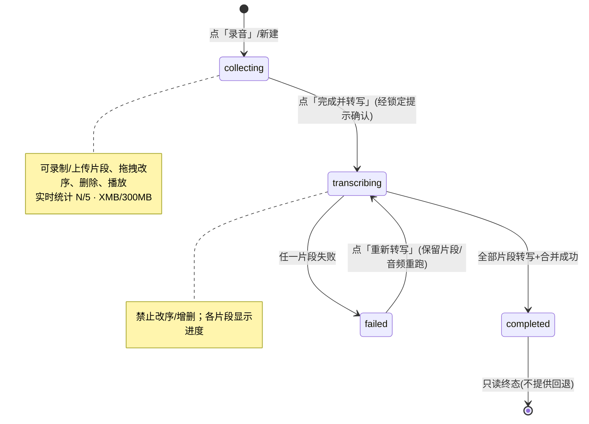

# 录音页面改造设计文档（多片段 + 手动转写）

> 范围：咨询 / 督导 / 受督历程的录音功能。
> 状态：设计定稿，实现中。与用户于 2026-09-03 ~ 09-05 逐条确认。
> 重新编辑分支暂不做（见 §11）。实现以本文件为准。

## 1. 背景与问题

原系统：录音 / 上传保存后**立即**触发后台转写（单文件）。这在单文件场景没问题。

新需求：一次历程**支持多片段上传（最多 5 个、总计 ≤300MB）**，片段可**拖拽调序**以拼成一个完整录音。

由此产生矛盾：
- 片段未凑齐就转写 → 顺序错、白转；
- 转写完再调序 → 文本与音频顺序对不上。

结论：必须把「片段收集」与「转写」**解耦**——转写只在用户点「完成并转写」后触发。

## 2. 已确认的产品规则

| 项 | 规则 | 备注 |
|---|---|---|
| 单文件上传上限 | ≤ **200MB** | `files.py` 录音上限 500→200 |
| 一次历程的录音会话数 | **仅 1 个**（无中间列表层） | 用户 09-03 20:24 确认 |
| 片段数 | 最多 **5** 个 | 超限禁添加 |
| 总大小 | 片段合计 ≤ **300MB** | 超限禁添加 |
| 单片段时长 | ≤ **2 小时** | 已有 `MAX_AUDIO_SECONDS=2h` |
| 总时长 | **不额外限制** | 仍受最多 5 段、单段 2 小时和总计 300MB 约束 |
| 合并方式 | **逻辑合并** | 各片段并行转写后按 `segment_index` 拼文本，不物理拼音频 |
| 转写触发 | **统一手动「完成并转写」** | 单 / 多文件一致 |
| 顺序处理 | 转写前弹**锁定提示**；开始后**禁止改序 / 增删** | 防反复变更 |
| 失败重试 | **全部片段重新转写** | 不复用部分片段的旧转写结果 |
| 终态 | `completed` 只读；`failed` 可「重新转写」 | 完成后录音不可单独删除或变更 |
| 原音频保留 | 每个片段自上传起保留 **14 天** | 转写完成后仍可在剩余期限内查看，到期自动删除 |
| 重新编辑 | **先记下、暂不做** | 见 §11 草稿 |

> 上传字节上限 500MB 仍可装 2 小时（≈115MB），200MB 单文件足够；总 300MB 覆盖 5×~60MB。

## 3. 页面结构与进入时机

- 一次历程 = **唯一 1 个录音会话**，故无「录音列表」中间层。
- 历程详情页的 **「录音」按钮** = 进入该会话的唯一入口：
  - 无录音 / 有未提交草稿 → 进**收集中**（空列表或带草稿片段）；
  - 转写中 / 已完成 → 进对应状态页（`completed` 展示转写 + 纪要 + 报告；`failed` 提供「重新转写」）。

## 4. 状态机

## 5. 交互细节

### 5.1 收集中
- **片段列表区**：每片段一张卡 = 序号① + 名称 / 时长 + 大小 + 🎵播放 + 拖拽手柄 + 删除×。
- **片段名称**：现场录音自动命名为「录音片段 1/2/3」；上传文件显示原文件名；MVP 不支持手动改名。拖拽只改变顺序，不改写名称。
- **底部操作栏**：「+ 录制片段」「+ 上传片段」；统计条 `3/5 · 182MB/300MB`（接近上限变黄、超限变红并禁添加）；主按钮「完成并转写」（至少 1 片段才可点）。
- **锁定时机**：点「完成并转写」→ 弹确认框：
  > 「将按当前顺序合并转写 N 段（合计 X 分钟 / Y MB）。开始后顺序锁定，无法增删或调整。确认开始？」
  → 取消 / 开始转写。

### 5.2 转写中
- 片段各自显示进度（转写 2/5…），整体「合并中…」；拖拽 / 删除 / 新增**置灰或隐藏**，显示「顺序已锁定」。

### 5.3 失败（failed）
- 显示错误原因；提供「重新转写」按钮 → 保留片段与音频，重跑全部片段 ASR + 重新合并（MVP 整段重跑，不区分单段）。

### 5.4 完成（completed，只读）
- 展示合并转写全文 + 纪要 + 报告（现有逻辑改为消费 `merged_transcript`）。
- **不提供**「重新编辑 / 重新转写」入口。
- 不提供单独删除录音的入口。若发现漏传，用户只能删除整个咨询 / 督导 / 受督历程，再新建历程重新上传和转写；历程删除时级联清除录音、转写、纪要和报告。
- 原音频不会在转写完成时立即删除；每个片段仍可查看至其上传满 14 天，随后自动销毁。文字、纪要和报告不受原音频到期影响。

## 6. 数据模型

### 6.1 recordings（复用现有顶层记录，对应一次历程的录音）
| 字段 | 类型 | 说明 |
|---|---|---|
| id | uuid | PK |
| session_id | uuid | 关联现有历程；已有唯一约束保证一次历程只有一条录音记录 |
| ai_status | str | pending / processing / completed / failed；前端分别展示为收集中 / 转写中 / 已完成 / 失败 |
| duration_seconds | int | 全部片段时长合计 |
| processing_error | text | 本轮处理失败原因 |
| created_at / updated_at | ts | |

> 不新建 `recording_sessions` 表，直接复用现有 `recordings`，避免引入重复的顶层会话模型。片段数与总大小按 `recording_segments` 实时汇总；合并全文和纪要继续写入现有 `recording_transcripts` / `recording_summaries`，不在顶层重复存储。

### 6.2 recording_segments（片段）
| 字段 | 类型 | 说明 |
|---|---|---|
| id | uuid | PK |
| recording_id | uuid | FK → recordings |
| segment_index | int | 顺序（1-based） |
| file_id | uuid | FK → files；存储 key、原名和到期时间继续由文件表管理 |
| duration_seconds | int | 秒 |
| size_bytes | bigint | 字节 |
| status | enum | uploaded / transcribing / transcribed / failed |
| transcript_json | json | 单段转写结构（逻辑合并用） |
| processing_error | text | 单段失败原因 |
| created_at / updated_at | ts | |

> 当前仍处测试阶段，历史录音数据允许全部清除，不做旧单文件到片段表的数据迁移。

## 7. 后端改造

### 7.1 上传上限（files.py）
- 录音类型上限 `500MB → 200MB`（`backend/app/api/routes/files.py` 常量），前端预校验 + 服务端硬卡。

### 7.2 新增 / 调整端点（routes/recordings.py）
| 方法 | 路径 | 说明 |
|---|---|---|
| POST | `/api/v1/recordings/{recording_id}/segments` | 添加片段（先 POST /files 拿 URL 上传，再登记 segment） |
| PUT | `/api/v1/recordings/{recording_id}/segments/reorder` | 提交新顺序（仅 pending / 收集中） |
| DELETE | `/api/v1/recordings/{recording_id}/segments/{segment_id}` | 删除一个片段（仅 pending / 收集中） |
| POST | `/api/v1/recordings/{recording_id}/processing` | 触发「完成并转写」；校验 1~5 片段、≤300MB、≤2h/段并锁定顺序 |
| POST | `/api/v1/recordings/{recording_id}/processing/retry` | failed → 全部片段重新转写 |
| DELETE | 由历程删除流程触发 | `completed` 不允许单独删除录音；删除整个历程时级联清片段、MinIO、转写、纪要和报告 |

> 现有 `start_processing`（返回 202）保留，改为由 `/transcribe` 调用；上传通道仍走 `/api/v1/files`。

### 7.3 转写与合并（services/ai + jobs）
- 沿用 `minio_url` 模式（`fun-asr` 异步文件识别，已落地）：各片段并行触发 ASR（各自 presigned URL，已延至 60min）。
- 全部片段 `transcribed` 后，后端按 `segment_index` 拼接 `transcript` → 写 `merged_transcript` → 调 `qwen-plus` 出 summary / report。
- 任一片段失败 → recording.ai_status=`failed`，记录原因；重新转写时清理本轮片段结果并重跑全部片段。

### 7.4 校验
- 添加片段时：单文件 ≤200MB、片段数 <5、合计 <300MB、单段 ≤2h（`MAX_AUDIO_SECONDS`）。
- 触发转写时：至少 1 片段、`ai_status==pending`、合计 ≤300MB。
- 每个片段的 14 天有效期从自身上传时间单独计算；后续添加片段不得刷新较早片段的到期时间。

## 8. 前端改造（apps/mobile/App.tsx 单体）

- 复用现有 `useAudioRecorder(RecordingPresets.HIGH_QUALITY)`，每段一次录音。
- 新增：
  - 片段列表 + 拖拽排序组件（RN `Reorder.List` / `Reorder.Item` 或手势库）；
  - 统计条组件（N/5 · XMB/300MB，超限变色）；
  - 锁定提示 `Modal`（RN `<Modal>`，符合移动端红线）；
  - 状态分支渲染：collecting / transcribing / failed / completed 四态 UI。
- 收集中允许逐段删除后重传；转写开始后禁止增删。完成后只能随整个历程删除而级联清理。
- 「录音」按钮逻辑：按会话状态跳转（新建 / 续草稿 / 完成态展示）。

## 9. 转写策略：逻辑合并

选择逻辑合并（非物理 ffmpeg 拼接）的原因：
- 无需在服务器装 ffmpeg（当前生产未装）；
- 各片段可以独立识别并按锁定顺序合并，避免处理超大物理合并文件；失败重试仍按产品规则重跑全部片段；
- 代价：片段交界半句话可能断开、说话人标号各段从头计（可接受，纪要模型会整体理解）。

## 10. 与既有落地的衔接

- 生产已切 `minio_url`、加 `MAX_AUDIO_SECONDS=2h`、下载 URL 延至 60min（2026-09-03 已上线）——**继续有效**，正好支撑多片段各自 fun-asr 转写。
- 本次设计只新增「多片段收集 + 手动触发 + 顺序锁定 + 200/5/300 约束 + failed 重转」，不动转写链路本身。

## 11. 完成后的更正方式

`completed` 是不可回退的只读终态，不设计「重新编辑」分支。若用户发现漏传或顺序错误，只能删除整个历程并新建历程重新处理。

## 12. 实现清单（精简 MVP，去掉重新编辑）

**后端**
1. [x] `files.py`：录音上限 500→200MB。
2. [x] 复用 `recordings`，新增 `recording_segments` + Alembic 迁移；清除测试阶段历史录音数据。
3. [x] 端点：add_segment / delete_segment / reorder / processing / retry，并接入历程删除级联。
4. [x] 转写 worker：并行 fun-asr + 按序合并 + qwen-plus 出纪要报告。
5. [x] 校验：200MB / 5 个 / 300MB / 2h。
6. [x] 单元测试：超限、顺序锁定、failed 重转。

**前端**
7. [x] 片段列表 + 拖拽排序 + 统计条。
8. [x] 锁定提示 Modal（转写前）。
9. [x] 四态 UI（collecting / transcribing / failed / completed）。
10. [x] 「录音」按钮按会话状态跳转。

**验证**
11. [ ] 真机：录 2 段 → 调序 → 完成并转写 → 看合并全文 + 纪要。
12. [ ] failed 模拟 → 重新转写成功。
13. [ ] 超限（6 片段 / >300MB / >200MB 单文件）被拦。
